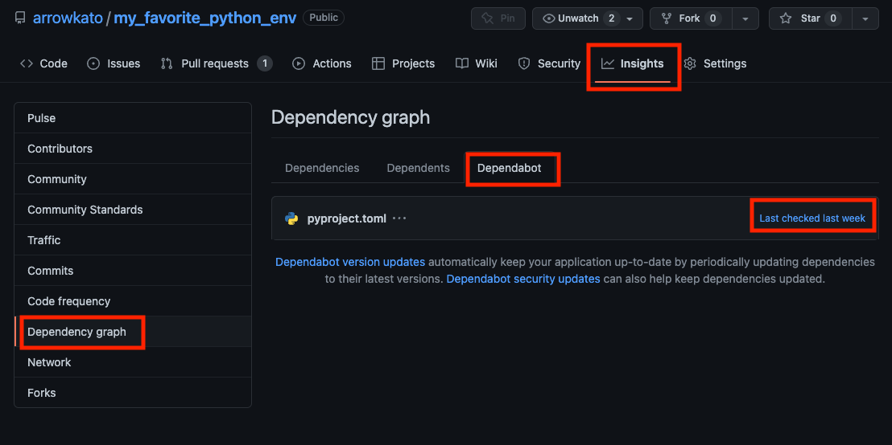
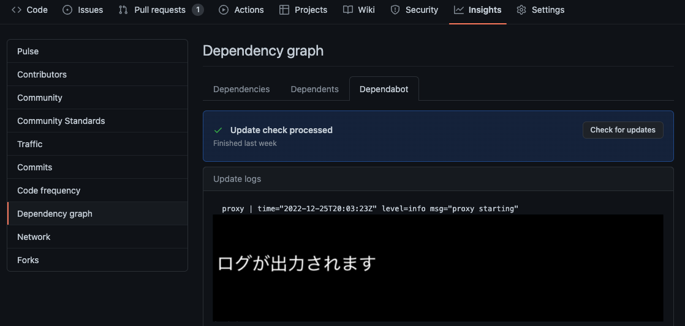

# 1. Dependabotを使うべき理由

## 1.1. ライブラリのバージョンアップに追随する必要性

ライブラリのバージョンアップは、小さく早く失敗して、大失敗を避けるという方針を推奨します。
例えば、1年放置後に一気にまとめてバージョンを上げると、
「複数のライブラリのバージョンアップによるバグを」踏んでデバッグの難易度が上がるリスクがあります。
可能なら、1ライブラリずつ、なおかつ、バージョンアップの幅を少しずつ上げると原因特定の難易度が下がる傾向にあり、トータルで見ると少ない労力でバージョンアップができます。
また、ライブラリに脆弱性があり、それが放置されているとまずいです。
1年に1回しかバージョンアップしなければ、脆弱性を1年放置する可能性がありますが、
週に1回ライブラリのバージョンアップをしていれば、リスクが下がます。

## 1.2. 競合製品との違い
[renovate](https://github.com/renovatebot/renovate) が同様の機能のサービスです。
このリポジトリでは、poetry かつ、他のプライベートリポジトリを参照したときにの Pull Request を出す設定が
Dependabot でしか動作しなかったので採用しています。
pip を採用した場合や、他のプログラミング言語のバージョン管理システムの場合は、調べていません。

## 1.3 バージョンアップの手間とバージョンアップのアップデートのリスクを減らして、運用したい

ライブラリのバージョンアップは単純作業で作業時間を最小のために自動化するべきです。
マイクロサービスが流行ってきたこともあって、1プロジェクトで管理するリポジトリが増えています。
ライブラリのアップデート(`poetry update` や `go get`) するだけでも、リポジトリが増えれば時間がかかります。
また、更新頻度が高いリポジトリならまだしても、更新頻度が低いリポジトリは、1年では無いくらい放置され、上記の特にセキュリティリスクを加速させます。

Dependabot は、1ライブラリごとのバージョンバージョンアップをPull Requestで出してくれます。[Pull Request の例](https://github.com/arrowkato/my_favorite_python_env/pull/10)
Pull Requestなので、CI での unit test が通過したもののみ merge する戦略を取ることで、バージョンアップのリスクを下げられます。

## 1.4 無料
renovate もそうですが、Pull Request の自動作成機能は無料です。ありがとうGitHub!!

# 2. Dependabot 設定方法
公式docの [Code security](https://docs.github.com/ja/code-security) から各種ドキュメントに飛べます。
Dependabotについては、2022年11月頃にローカライズが急に進んだ印象です。母国語で読めるのはありがたいです。

## 2.1 設定ファイル
[dependabot.yml](../.github/dependabot.yml) 参照。
シークレットの設定(次節参照)をしない場合、 `.github/dependabot.yaml` に配置すれば自動で動きます。

動作した or エラーログは、
1. GitHubの該当リポジトリの `Insights` タブをクリック
2. 左サイドバーの `Dependency graph` をクリック
3. `Depnedabot` タブをクリック。ただし、閲覧権限が必要です。
4. `Last Checked <最終実行タイミング>` をクリック

1, 2, 3, 4の操作手順  

実行ログの例。Dependabot のジョブを再実行したいときは、`Check for updates` ボタンをクリック  

## 2.2 シークレットの設定
必要になるケースとしては、
バージョン管理システムでの設定ファイル(このリポジトリの場合は、pyproject.toml) で、公開されているリポジトリのみを参照している場合は、設定する必要はありません。

ありえるパターンとして、
参画しているプロジェクト(≒ GitHub organization or GitHub Enterprise)で複数リポジトリで開発を行っており、
同じorganizationで他の「プライベート」リポジトリ(例えば、そのプロジェクトでの共通ライブラリ)をパッケージマネージャー(本リポジトリはpoetry)上から参照する場合、
パッケージマネージャーは他のプライベートリポジトリ(今回は、 arrowkato/my_private_repo )を参照する時に、アクセス情報(今回はsshでの接続情報)が必要です。
このアクセス情報は、秘匿情報なので、Gitには登録しない運用をする必要があります。

方法は、公式docの
[Dependabot に対する暗号化されたシークレットを管理する](https://docs.github.com/ja/code-security/dependabot/working-with-dependabot/managing-encrypted-secrets-for-dependabot) 参照してください。

大きく2パターンあり、リポジトリにシークレットを追加するか、Organization にシークレットを追加するかの違いがあります。
特定のリポジトリのみに、設定する場合は、 [「Dependabot にリポジトリシークレットを追加する」](https://docs.github.com/ja/code-security/dependabot/working-with-dependabot/managing-encrypted-secrets-for-dependabot#dependabot-%E3%81%AB%E3%83%AA%E3%83%9D%E3%82%B8%E3%83%88%E3%83%AA%E3%82%B7%E3%83%BC%E3%82%AF%E3%83%AC%E3%83%83%E3%83%88%E3%82%92%E8%BF%BD%E5%8A%A0%E3%81%99%E3%82%8B)を採用してください。
逆に、 対象のorganizationのリポジトリのほぼ全てに、Dependabotを導入する予定なら、
[「Dependabot に Organization シークレットを追加する」](https://docs.github.com/ja/code-security/dependabot/working-with-dependabot/managing-encrypted-secrets-for-dependabot#dependabot-%E3%81%AB-organization-%E3%82%B7%E3%83%BC%E3%82%AF%E3%83%AC%E3%83%83%E3%83%88%E3%82%92%E8%BF%BD%E5%8A%A0%E3%81%99%E3%82%8B)での設定が適していると思います。

余談  
ちなみに、Organization とリポジトリの両方に同名のシークレットを登録すると、リポジトリで設定したシークレットが優先されます。

## 2.3 デバッグ
[Dependabot の cli 実行ツール](https://github.com/dependabot/cli) があるので、それを使いましょう。
Dependabot は、GitHub 側で実行されます。2.1 で示したように実行ログは見る事はできます。
ただ、Dependabotが失敗しており、デバッグする場合、dependabot.yml を編集、 `git commit` して、 `git push` して、再実行となるとgitの履歴も汚れますし、レビュー必須としている場合には、デバッグが大変手間です。
GitHub Actions のローカル実行ツールに [act](https://github.com/nektos/act) があるように Dependabot には、[dependabot の cli 実行ツール](https://github.com/dependabot/cli) があります。
