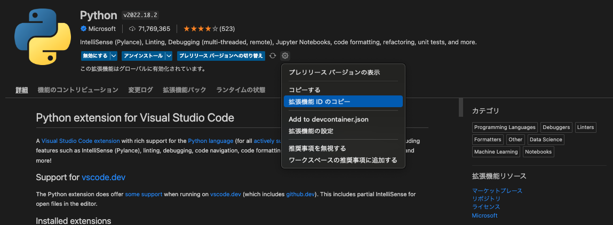

# 選定理由
VS Codeの拡張機能 [Dev Containers](https://marketplace.visualstudio.com/items?itemName=ms-vscode-remote.remote-containers) を使うと、いわゆるローカルで開発する際と同じ開発者体験ができるためです。

論より証拠、Docker Desktop のデーモンが起動していることを確認して、
VS Codeでこのリポジトリを開いてください。
左下に `Reopen in Container` というボタンが出てくると思うので、クリックすると、
docker-compose で起動したコンテナにアタッチした状態になります。
後は普段どおりに、開発してください。

技術的な詳細は、 [Dev Container公式doc](https://code.visualstudio.com/docs/remote/containers) 参照です。

今回は、公開目的で、 `.devcontainer` 配下と `.vscode` 配下を git に登録していますが、
エディター, IDEについては共有しないならば、 .gitignore に上記2フォルダを追加する運用もありです。

# VS Codeの設定ファイル setting.json
Mac Userの場合は
`$HOME/Library/Application Support/Code/User/settings.json` (Application のあとに、半角スペースがあることに注意)にあり、これはユーザ全体で共有されている設定です。
プロジェクトごとに設定(を上書き)する場合は、 `プロジェクトのフォルダ/.vscode/settings.json` に記載してください。
ファイル保存時に、各種linter formatterでチェックする設定を書いています。コメントを読めばだいたい分かるはずです。

# Dev Containerのちょっと意外な仕様
なんと、普段使っている拡張機能とは「別途」設定する必要があります。
コンテナ内で使用する VS Code の拡張機能は、`プロジェクトのフォルダ/.devcontainer/devcontainers.json` に記載してください。
例を見るとわかると思いますが、 `ms-python.python` のように、拡張機能のIDを記載してください。
IDの探し方は、
1. VS Codeでお目当ての拡張機能を探す
2. 歯車をクリック
3. 拡張機能 ID のコピーをクリック↓参照

